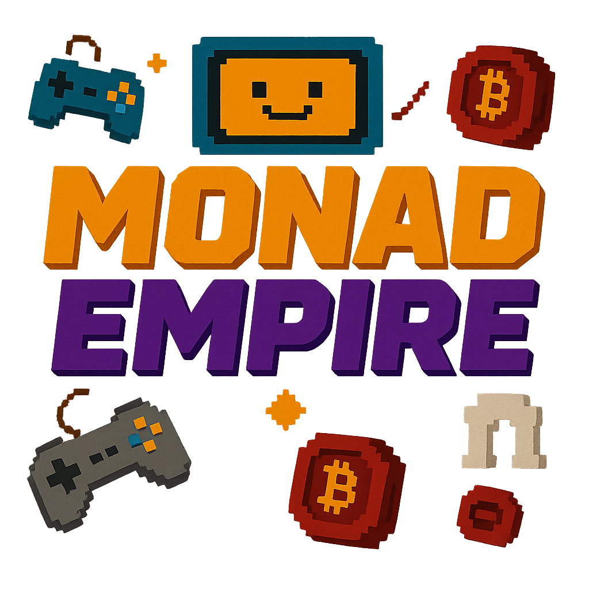

# Monad Empire Game



An incremental blockchain-based game, developed with Next.js, Prisma, and MongoDB, powered by the Monad Testnet.

## 🚀 Features

* **Connect Metamask Wallet** — Easily connect your Metamask wallet to interact with the game.
* **Testnet Transactions** — Every time you level up, a transaction is made on the Monad Testnet.
* **Accumulate Wealth** — Keep growing your empire and climb the ranks.
* **Leaderboard (Coming Soon)** — Compete against others as you progress.

---

## 🛠️ Tech Stack

* **Frontend:** Next.js, TailwindCSS, Shadcn UI
* **Backend:** Prisma, MongoDB, Neon Database
* **Blockchain:** Monad Testnet
* **Libraries:** Radix UI, React Query, Zustand, Recharts

---

## 📦 Installation

```bash
# Clone the repository
git clone git@github.com:silverhandbtc/monad-empire-game.git

# Navigate to the project directory
cd monad-empire-game

# Install dependencies
npm install

# Generate Prisma Client
npx prisma generate

# Run the application
npm run dev
```

Access the application at [http://localhost:3000](http://localhost:3000).

---

## 🔑 Environment Variables

Create a `.env` file in the root directory and add the following:

```env
NEXT_PUBLIC_API_URL=<your-api-url>
NEXT_PUBLIC_SITE_URL=<your-site-url>
NEXT_PUBLIC_MONAD_CHAIN_ID=<monad-chain-id>
NEXT_PUBLIC_MONAD_RPC_URL=<monad-rpc-url>
NEXT_PUBLIC_MONAD_EXPLORER_URL=<monad-explorer-url>
NEXT_PUBLIC_MONAD_CHAIN_NAME=<monad-chain-name>
NEXT_PUBLIC_MONAD_SYMBOL=<monad-symbol>
NEXT_PUBLIC_MONAD_NAME=<monad-name>
NEXT_PUBLIC_MONAD_DECIMAL=<monad-decimal>
DATABASE_URL=<your-database-url>
```

---

## 🗂️ Project Structure

```plaintext
├── public
│   └── logo.png
├── prisma
│   └── schema.prisma
├── src
│   ├── components
│   ├── pages
│   ├── services
│   └── utils
├── .env
├── package.json
├── README.md
└── tsconfig.json
```

---

## 🤝 Contributing

1. Fork the project
2. Create your feature branch (`git checkout -b feature/NewFeature`)
3. Commit your changes (`git commit -m 'Add new feature'`)
4. Push to the branch (`git push origin feature/NewFeature`)
5. Open a Pull Request

---

## 📝 License

This project is licensed under the MIT License.

---

## 🌐 Links

* [Website](https://monad-empire-game.vercel.app)
* [GitHub Issues](https://github.com/silverhandbtc/monad-empire-game/issues)
* [Documentation](https://monad-empire-game.vercel.app/docs)

---

Developed with 💙 by [silverhandbtc](https://github.com/silverhandbtc)
